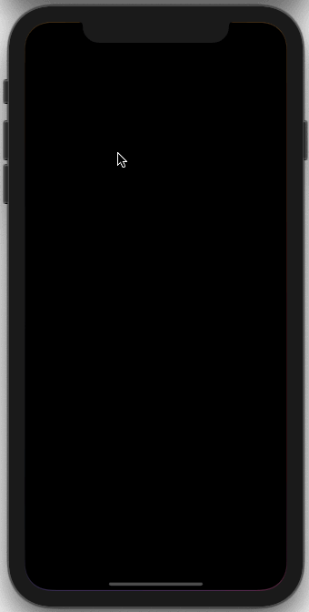

# Bevi!acqua Plant Care App
First attempt to develop a cross-platform app.
Free assignment. 

## Technologies
* Ionic4 Framework 
* Angular
* Firebase Authentication
* Firestore 
* Firestorage

## Installed Ionic Native Plugins 
* Camera: choose or take a picture
* Email Composer: send a list of your due plants via email
* Vibration: lets you think twice about deleting your plant collection
* Local Notification: reminds you if there are plants due

## About Bevi!acqua
This app helps you to catalogue your plants and keep track of their water needs.
You can add plants, save their planting date (yes, plants also celebrate their birthdays!), 
define their watering intervals and note their location.
And since no plant looks the same, you can also individualize their avatars by taking a picture or choosing one from your camera roll.
All your plants are displayed in the "My Plants"-Tab.

The "Water Me"-Tab provides you with an overview of all plants that need watering today. 
Local Notifications remind you to care for them in case you forget.

## Screencast Example

#### Disclaimer
This app was developed with no prior knowledge of App Development, Angular and Ionic.

